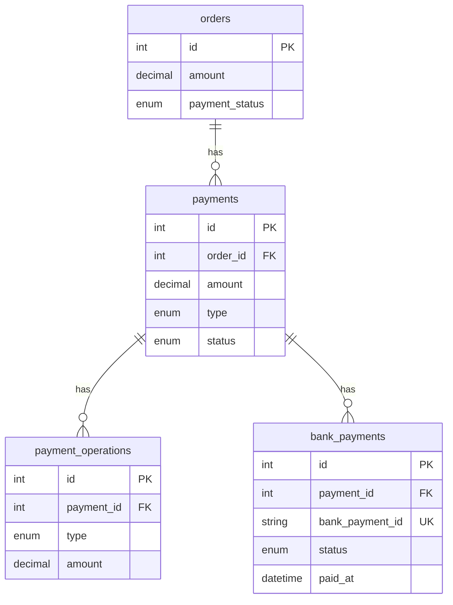

# Payment Service

Сервис для работы с оплатой заказов (наличные + эквайринг), включая операции `deposit` / `refund`, хранение состояния банковских платежей и синхронизацию с внешним API банка.

## Стек

- Python 3.12
- FastAPI
- SQLAlchemy 2.x
- Alembic
- Pytest

## Запуск локально

### 1) Установка зависимостей

```bash
uv sync --all-groups
```

### 2) Настройка окружения

Используются настройки из `app/core/config.py`.
Минимально необходимы:

- `DATABASE_URL` — основная БД
- `TEST_DATABASE_URL` — тестовая БД
- `BANK_URL` — базовый URL внешнего банка

### 3) Применение миграций

```bash
alembic upgrade head
```

### 4) Запуск приложения

```bash
uv run uvicorn app.main:app
```

Документация OpenAPI будет доступна по адресу:
- `http://localhost:8000/docs`


## Тесты

```bash
uv run pytest
```

## Основные API ручки

- `POST /orders/{order_id}/payments` — создать платеж
- `POST /orders/{order_id}/acquiring-payments` — создать эквайринговый платеж и инициировать платеж в банке
- `POST /payments/{payment_id}/deposit` — внести средства по платежу
- `POST /payments/{payment_id}/refund` — вернуть средства по платежу
- `POST /payments/{payment_id}/acquiring-sync` — синхронизировать состояние эквайринга с банком

## Правила домена

- Сумма в операциях (`create`, `deposit`, `refund`) должна быть строго больше нуля.
- Сумма всех созданных платежей по заказу не должна превышать сумму заказа.
- Сумма внесений по конкретному платежу не должна превышать сумму платежа.
- Сумма возвратов по конкретному платежу не должна превышать уже внесенную сумму.
- Статус заказа обновляется автоматически:
  - `unpaid` / `partially_paid` / `paid`.

## Жизненный цикл `Payment.status`

- `pending` — платеж создан, еще нет успешных внесений.
- `succeeded` — по платежу есть положительный нетто-взнос (`deposit - refund > 0`).
- `refunded` — взнос был, но полностью сторнирован (`deposit - refund == 0`).
- `failed` — платеж помечен как неуспешный (например, при ошибке `acquiring_start` или при `failed` из банка без захваченной суммы).

## Визуальная ER-диаграмма (Mermaid)



## Визуальная схема потока эквайринга

```mermaid
sequenceDiagram
    participant C as Client
    participant API as Payment Service API
    participant S as PaymentService
    participant B as Bank API

    C->>API: POST /orders/{order_id}/acquiring-payments
    API->>S: create_payment(type=acquiring)
    API->>B: acquiring_start(order_number, amount)
    B-->>API: bank_payment_id
    API-->>C: payment + bank link

    C->>API: POST /payments/{payment_id}/acquiring-sync
    API->>B: acquiring_check(bank_payment_id)
    B-->>API: status + amount + paid_at
    API->>S: deposit/refund (if needed)
    API-->>C: bank_payment status